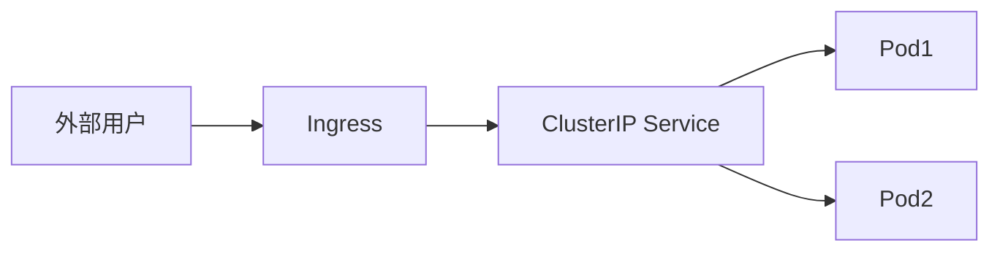

+++
date = '2025-05-20T10:38:28+08:00'
draft = true
title = '基于K8s的应用自动化部署平台'
tags = ['K8s','prometheus','Grafana']
categories = ['K8s','prometheus','Grafana']
+++

## 项目目录结构

```bash
k8s-deploy-platform/
├── helm-charts/                    # Helm Chart模板
│   └── app-template/              
│       ├── Chart.yaml             # Chart基本信息
│       ├── values.yaml            # 默认配置值
│       └── templates/             # K8s资源模板
│           ├── deployment.yaml    # 部署配置
│           ├── service.yaml       # 服务配置
│           └── ingress.yaml       # 入口配置
│
├── manifests/                      # K8s资源清单
│   ├── applications/              # 应用相关配置
│   │   └── app-template.yaml     
│   ├── logging/                   # 日志系统配置
│   │   └── efk-values.yaml      
│   └── monitoring/               # 监控系统配置
│       ├── prometheus-rules.yaml  # 监控规则
│       ├── prometheus-values.yaml # Prometheus配置
│       ├── pv.yaml               # 持久化卷
│       └── storageclass.yaml     # 存储类
│
└── scripts/                        # 自动化脚本
    ├── install.sh                 # 安装脚本
    └── deploy.sh                  # 部署脚本
```
### helm-charts/app-template
#### Chart.yaml
```yaml
apiVersion: v2
name: app-template
description: 一个基础的应用部署模板
version: 0.1.0
type: application
```
  
  
#### values.yaml
```yaml
# 应用配置
name: myapp
replicas: 2
image: nginx:latest

# 资源配置
resources:
  requests:
    memory: "64Mi"
    cpu: "250m"
  limits:
    memory: "128Mi"
    cpu: "500m"

# 健康检查配置
healthCheck:
  enabled: true
  path: /health
  port: 8080
  initialDelay: 30
  period: 10

# 服务配置
service:
  type: ClusterIP
  port: 80
  targetPort: 8080

# Ingress配置
ingress:
  enabled: false
  className: nginx
  host: myapp.example.com
  path: /
  pathType: Prefix
```
value.yaml中service类型为ClusterIP,clusterip仅在集群内部可以访问，与之对应的是nodeport，nodeport在**所有节点**上开放指定端口（30000-32767）  
clusterIP让外部访问的方式：  
可以通过配置ingress  


也可以使用这条命令临时端口转发
```bash
kubectl port-forward -n monitoring svc/monitoring-grafana 3000:80
```

#### templates/deployment.yaml
```yaml
apiVersion: apps/v1
kind: Deployment
metadata:
  name: {{ .Values.name }}
spec:
  replicas: {{ .Values.replicas }}
  selector:
    matchLabels:
      app: {{ .Values.name }}
  template:
    metadata:
      labels:
        app: {{ .Values.name }}
    spec:
      containers:
      - name: {{ .Values.name }}
        image: {{ .Values.image }}
        resources:
          {{ toYaml .Values.resources | nindent 12 }}
        {{- if .Values.healthCheck.enabled }}
        livenessProbe:
          httpGet:
            path: {{ .Values.healthCheck.path }}
            port: {{ .Values.healthCheck.port }}
          initialDelaySeconds: {{ .Values.healthCheck.initialDelay }}
          periodSeconds: {{ .Values.healthCheck.period }}
        {{- end }}
```
deployment.yaml这样配置可以根据values.yaml中的配置动态生成deployment资源，相当于values.yaml定义变量，方便修改
#### templates/service.yaml
```yaml
apiVersion: v1
kind: Service
metadata:
  name: {{ .Values.name }}
spec:
  type: {{ .Values.service.type }}
  ports:
    - port: {{ .Values.service.port }}
      targetPort: {{ .Values.service.targetPort }}
      protocol: TCP
  selector:
    app: {{ .Values.name }}
```
### templates/ingress.yaml
```yaml
{{- if .Values.ingress.enabled }}
apiVersion: networking.k8s.io/v1
kind: Ingress
metadata:
  name: {{ .Values.name }}
spec:
  ingressClassName: {{ .Values.ingress.className }}
  rules:
    - host: {{ .Values.ingress.host }}
      http:
        paths:
          - path: {{ .Values.ingress.path }}
            pathType: {{ .Values.ingress.pathType }}
            backend:
              service:
                name: {{ .Values.name }}
                port:
                  number: {{ .Values.service.port }}
{{- end }}
```
### manifests
#### applications/app-template.yaml
```yaml
apiVersion: apps/v1
kind: Deployment
metadata:
  name: {{ .Values.name }}
spec:
  replicas: {{ .Values.replicas }}
  selector:
    matchLabels:
      app: {{ .Values.name }}
  template:
    metadata:
      labels:
        app: {{ .Values.name }}
    spec:
      containers:
      - name: {{ .Values.name }}
        image: {{ .Values.image }}
        resources:
          {{ toYaml .Values.resources | nindent 12 }}
        {{- if .Values.healthCheck.enabled }}
        livenessProbe:
          httpGet:
            path: {{ .Values.healthCheck.path }}
            port: {{ .Values.healthCheck.port }}
          initialDelaySeconds: {{ .Values.healthCheck.initialDelay }}
          periodSeconds: {{ .Values.healthCheck.period }}
        {{- end }}
```
#### logging/efk-values.yaml
暂时还不会
#### monitoring/prometheus-rules.yaml
```yaml
apiVersion: monitoring.coreos.com/v1
kind: PrometheusRule
metadata:
  name: app-alerts
  namespace: monitoring
spec:
  groups:
  - name: app
    rules:
    - alert: HighCPUUsage
      expr: container_cpu_usage_seconds_total > 80
      for: 5m
      labels:
        severity: warning
      annotations:
        description: "容器 CPU 使用率超过 80%"
    
    - alert: HighMemoryUsage
      expr: container_memory_usage_bytes > 80
      for: 5m
      labels:
        severity: warning
      annotations:
        description: "容器内存使用率超过 80%"
```
#### monitoring/prometheus-values.yaml
```yaml
prometheus:
  enabled: true
  serverFiles:
    prometheus.yml:
      global:
        scrape_interval: 15s
      scrape_configs:
        - job_name: 'kubernetes-pods'
          kubernetes_sd_configs:
            - role: pod
        - job_name: 'kubernetes-nodes'
          kubernetes_sd_configs:
            - role: node
  
  persistence:
    enabled: true
    size: 10Gi

grafana:
  enabled: true
  adminPassword: admin
  persistence:
    enabled: true
    size: 5Gi
    type: pvc
    storageClassName: local-storage
```
grafana实现持久化存储时，需要配置storageClassName，这个storageClassName需要在k8s集群中已经存在，这里使用的是local-storage
#### monitoring/storageclass.yaml
```yaml
class.yaml 
apiVersion: storage.k8s.io/v1
kind: StorageClass
metadata:
  name: local-storage
provisioner: kubernetes.io/no-provisioner
volumeBindingMode: Immediate
```
#### monitoring/pv.yaml
```yaml
apiVersion: v1
kind: PersistentVolume
metadata:
  name: grafana-pv
spec:
  capacity:
    storage: 5Gi
  accessModes:
    - ReadWriteOnce
  persistentVolumeReclaimPolicy: Retain
  storageClassName: local-storage
  local:
    path: /mnt/data
  nodeAffinity:
    required:
      nodeSelectorTerms:
      - matchExpressions:
        - key: kubernetes.io/hostname
          operator: In
          values:
          #- master  # 替换为你的节点名称
          - work-node1
```
注意：
- 这里的path需要创建好，否则会报错
- nodeAffinity是为了保证grafana的数据不会被其他节点的pod所使用，就一个工作节点所以没写，master节点上一般会有污点，最好调度到工作节点上  
  
### scripts
#### install.sh
```bash
# filepath: scripts/setup-cluster.sh
#!/bin/bash

# 启动本地集群
start_cluster() {
    echo "Starting minikube cluster..."
    minikube start --driver=docker \
        --memory=4096 \
        --cpus=2 \
        --kubernetes-version=v1.24.0
}

# 安装必要的组件
install_components() {
    # 添加 Helm 仓库
    helm repo add prometheus-community https://prometheus-community.github.io/helm-charts
    helm repo add elastic https://helm.elastic.co
    helm repo update
}

# 创建必要的命名空间
create_namespaces() {
    kubectl create namespace monitoring
    kubectl create namespace logging
    kubectl create namespace applications
}

main() {
    start_cluster
    install_components
    create_namespaces
}

main "$@"
```
#### deploy.sh
```bash
#!/bin/bash

# 设置变量
APP_NAME=$1
IMAGE=$2
NAMESPACE=${3:-applications}
REPLICAS=${4:-1}

# 验证输入
if [ -z "$APP_NAME" ] || [ -z "$IMAGE" ]; then
    echo "Usage: $0 <app-name> <image> [namespace] [replicas]"
    exit 1
fi

# 部署应用
deploy_application() {
    echo "Deploying $APP_NAME..."
    helm upgrade --install $APP_NAME ./helm-charts/app-template \
        --namespace $NAMESPACE \
        --set name=$APP_NAME \
        --set image=$IMAGE \
        --set replicas=$REPLICAS
}

main() {
    deploy_application
}

main "$@"
```
项目暂时完成，grafana全是英文暂时不熟练，后续再完善


